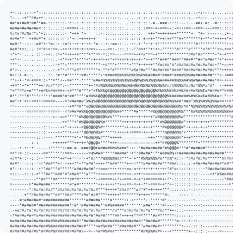

<table width="100%">
  <tr>
    <td width="50%" valign="top">
      <picture>
        <source media="(prefers-color-scheme: dark)" srcset="./ascii-dark.svg">
        
      </picture>
    </td>
    <td width="50%" valign="top">
      <h2>hey, i’m Yohance.</h2>
      
I’m a computer science student and software builder interested in useful tools—especially where automation, AI, and thoughtful product engineering meet.

      
Software is a creative medium. I like making things that remove busywork and give people better ways to understand what is in front of them.

      
Here are some of my creations:

      <ul>
        <li><strong><a href="https://github.com/yohanc3/resumemaxxer">ResumeMaxxer</a></strong>: Watches for new roles, tailors a resume to each job description, and delivers ready-to-edit applications through Telegram.</li>
        <li><strong><a href="https://github.com/yohanc3/digreddit">DigReddit</a></strong>: Turns Reddit conversations into ranked product leads with keyword matching and semantic scoring.</li>
      </ul>
      
<a href="https://www.linkedin.com/in/yohanc3">LinkedIn</a> · <a href="https://yohance.dev">yohance.dev</a>

    </td>
  </tr>
</table>
